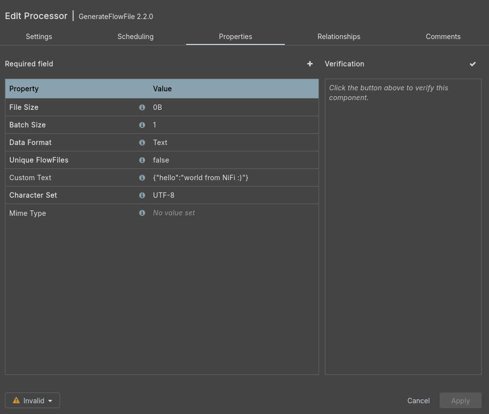
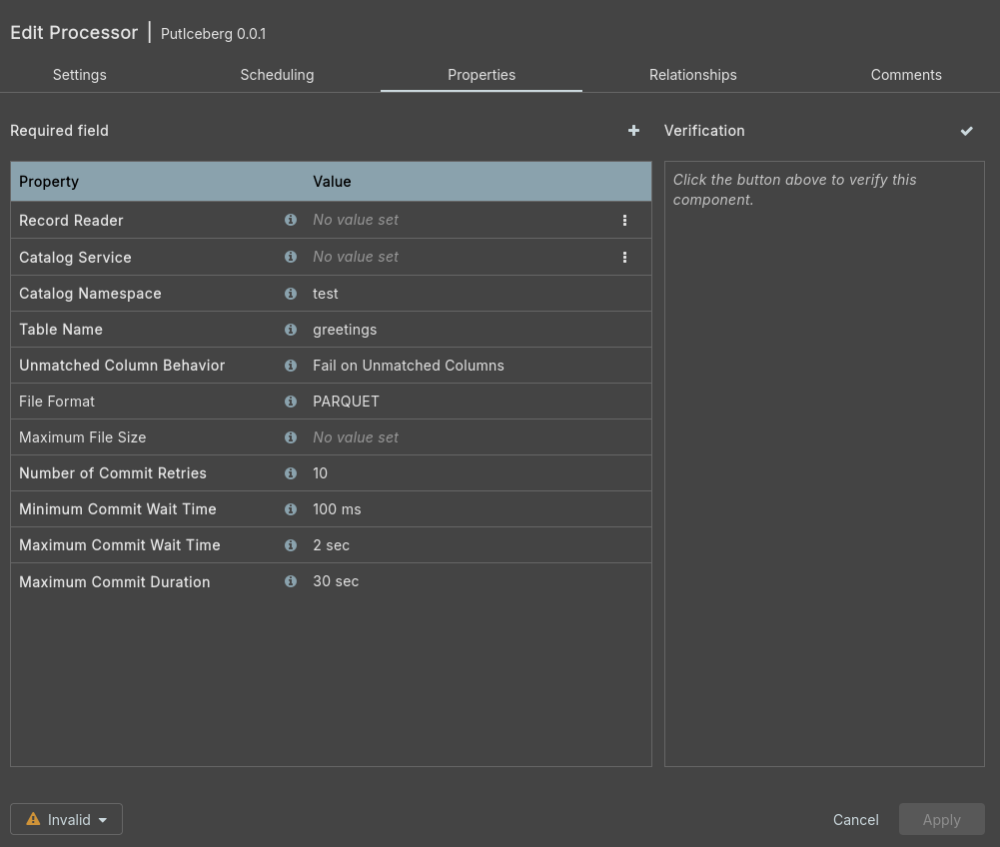
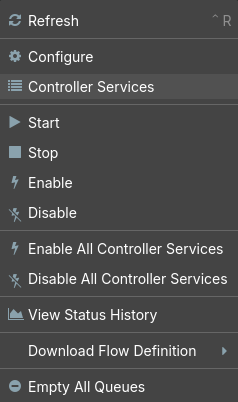
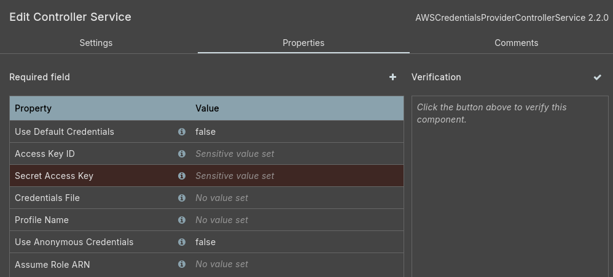
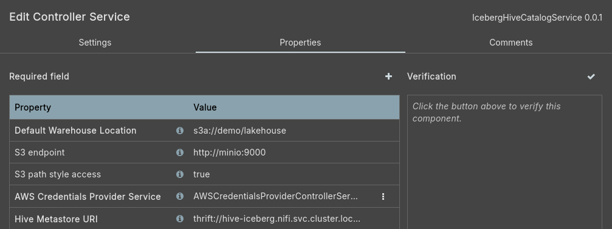
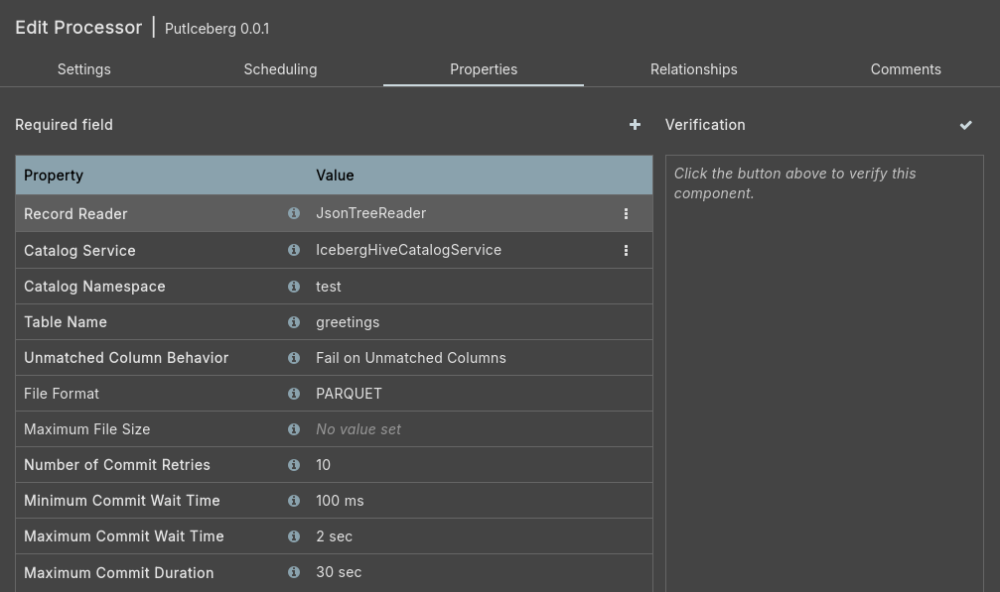

# nifi-iceberg-bundle

NiFi `1.19.0` added support for the PutIceberg processor in [NIFI-10442](https://issues.apache.org/jira/browse/NIFI-10442).
Just before `2.0.0` (and after `2.0.0-M4`), it has been removed in [NIFI-13938](https://issues.apache.org/jira/browse/NIFI-13938) due to Hive 3 being end of life and the number of CVEs caused by it.
This repos is based on the [removal PR](https://github.com/apache/nifi/pull/9460) with some feature removals and additions.

> [!WARNING]
> Although we took some steps of updating dependencies and removing dependencies alongside with functionality, the situation is still relevant.
> You need to decide if the added functionality is worth the added CVEs.

## Functionality

The following NiFi versions are supported:

* `2.4.0`

Currently, the following features are supported:

* S3 object storage support
* HDFS support
* Hive metastore as catalog implementation
* Parquet, ORC and Avro file formats
* Kerberos support (for Hive metastore and HDFS)

The following functionality has been added over the original implementation:

1. You don't need to rely on an `core-site.xml` somewhere in the NiFi filesystem to use S3. Instead, we made the relevant configuration options (such as S3 endpoint, path style access etc.) configurable via the NiFi UI.
2. We integrated with the `AWS Credentials Provider service`, so that it's easier to retrieve S3 credentials.

The following features were not carried over from the original implementation:

* JDBC catalog
* Hadoop catalog

## Usage

### Load extensions in NiFI

We are aiming to ship the NiFi extensions in the Stackable NiFi images by default starting with Stackable Data Platform 25.7.
We also have a guide how to [load custom NAR files yourself](https://docs.stackable.tech/home/stable/nifi/usage_guide/custom-components/custom-nars/).

Loading custom NARs basically boils down to

1. Run `sed -i -e 's/{{ NIFI_VERSION }}/2.4.0/g' pom.xml` to test-replace the version of the parent pom.
   This is needed, as Maven is not able to evaluate `${nifi.version}` in the `project.parent.version` field.
   Maybe a future version of Maven can handle this, in that case this step can be removed.
2. Run `mvn -D nifi.version=2.4.0 clean package` to build the needed NAR files.
   Please check that the NiFi version you are building for is supported and adopt the NiFi version accordingly.
3. Copy all `.nar` files into either
   1. The `<nifi-root-dir>/lib` folder, for Stackable `/stackable/nifi/lib/`
   2. Or into any other (arbitrary) folder and instruct NiFi to pull them in via `nifi.nar.library.directory.myCustomLibs: /my-custom-folder`

### Requirements

You need to provide the following things:

1. S3 object storage. This guide assumes a MinIO installation with the endpoint `http://minio:9000` access key `admin` and secret key `adminadmin`
2. Hive metastore service (HMS), currently without authentication. This guide assumes it is reachable at `thrift://hive-iceberg.nifi.svc.cluster.local:9083`.
3. Some existing Iceberg table. As NiFi currently can not create Iceberg tables, you need to use a different engine, such as Spark or Trino.\
   This guide created the table using the following Trino SQL statements

```sql
CREATE SCHEMA iceberg.test WITH (location = 's3a://demo/lakehouse/test');
create table iceberg.test.greetings (
	hello varchar
);
```

### Create GenerateFlowFile processor

Drag and drop the `Processor` icon onto the canvas, search for the `GenerateFlowFile` processor and click `Add`.
Afterwards double-click it to configure it.
As `Custom Text` enter `{"hello":"world from NiFi :)"}`.

You configuration now should look like



Click `Apply`.

### Create PutIceberg processor

Add the `PutIceberg` processor similar to the `GenerateFlowFile` processor.



As you can see the required fields `Record Reader` and `Catalog service` are missing.
You are going to create controller services now, which you can use there.
For now click on `Apply`.

### Create record reader service

As the `GenerateFlowFile` processor is putting out JSON, we are going to use a `JsonTreeReader` controller service to parse it.

Right click anywhere on the canvas and select `Controller services`:



Hit the Plus (`+`) in the top right corner and add a `JsonTreeReader`.
No special configurations are needed.

### Create AWS credentials provider service

The next step is to add an `AWSCredentialsProviderControllerService`.
Use the three dots -> `Edit` to configure it.
Set `Access Key ID` to `admin` and `Secret Access Key` to `adminadmin`.
Afterwards hit `Apply`.



### Create Iceberg hive catalog service

Now you need to configure the Iceberg catalog, HMS in this case.
Crate an `IcebergHiveCatalogService` controller service.
Set ` Default Warehouse Location` to `s3a://demo/lakehouse`, `S3 endpoint` to `http://minio:9000`, `Hive Metastore URI` to `thrift://hive-iceberg.nifi.svc.cluster.local:9083` and `S3 path style access` to `true`.
In the `AWS Credentials Provider Service` dropdown select the `AWSCredentialsProviderControllerService` you just created.



### Finish PutIceberg configuration

You can now configure the `PutIceberg` processor to use the new controller services:



Start all controller services by right-clicking anywhere on the canvas and selecting `Enable all Controller services`:


### Start flow

Connect processors as shown in the picture below, start the `PutIceberg` processor.
Right-click the `GenerateFlowFile` and select `Run once`.


This should result in one FlowFile ending up in `success`, which indicates we have successfully inserted a row into the Iceberg table.
We can check this using Trino:

```sql
trino> select * from iceberg.test.greetings;
       hello
--------------------
 world from NiFi :)
```

